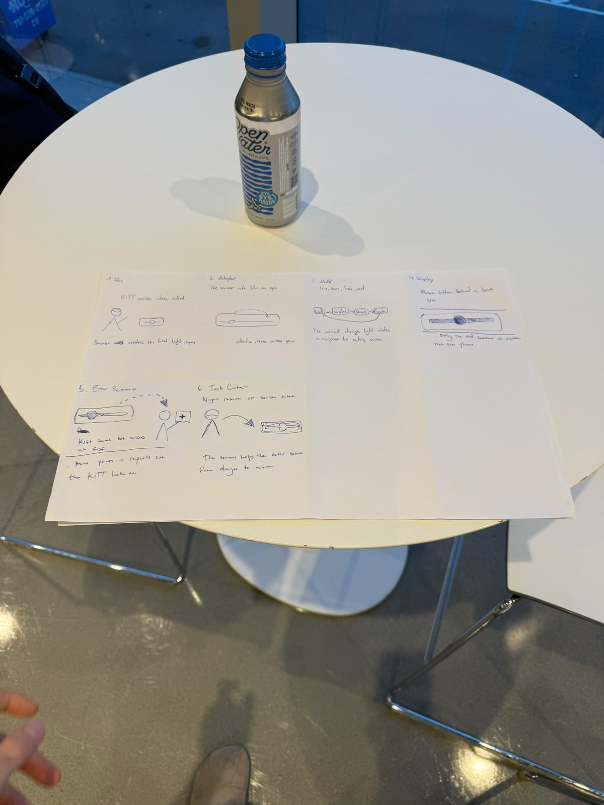
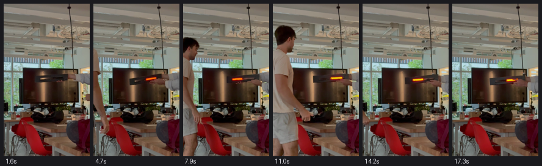
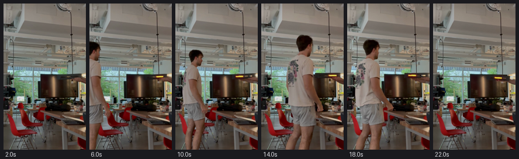
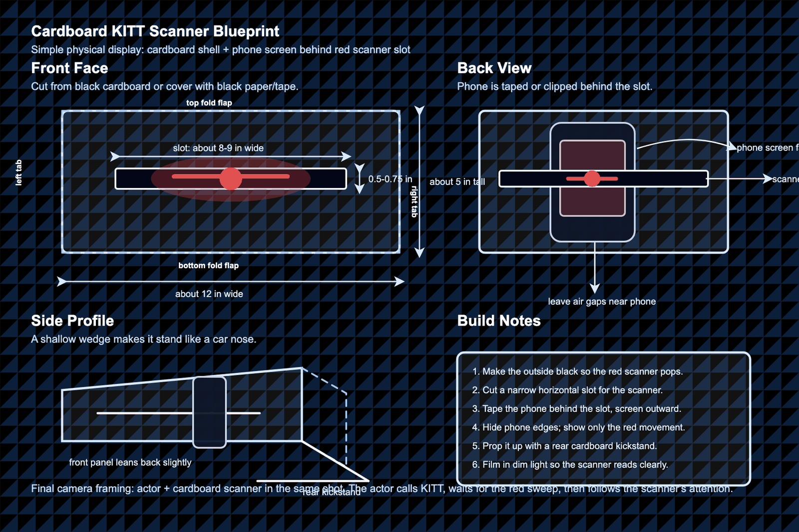

# Recreating the Masters of Interactive Light

**Andreas Kilbinger.** Originally partnered with **Dylan Johnson Restrepo**, who has
since dropped the class. See [Credits and contributions](#credits-and-contributions) at
the bottom — a substantial part of the concept work on this page predates my joining the
project, and is credited there rather than claimed here.

**THE MASTERWORK DRAWN FROM THE HAT: KITT's red scanner, from *Knight Rider* (1982).**

---

# The Report

## Part 0. Know Your Master

*Knight Rider* ran on NBC from 1982 to 1986. Its co-star was a car: KITT, the Knight
Industries Two Thousand, a black Pontiac Trans Am with an artificial intelligence. Almost
nothing about the car's exterior signals that it is alive except one thing — a red light
mounted across the nose that sweeps side to side. The effect was built by Glen A. Larson's
production team, and the sweeping-red-bar motif is now known generally as a *Larson
scanner*.

**The core interaction is that a human speaks and the light answers.** That is the whole
of it. KITT has no face, no gestures, no body language. When Michael Knight calls out, the
scanner starts moving; when KITT is thinking, it sweeps slowly; when KITT is hunting, it
sweeps faster; when KITT finds something, it pulses. The audience reads intention,
attention and mood out of a red bar moving at different speeds, and it works because the
actor treats the light as a partner — he talks to it, waits for it, and reacts to what it
does.

What the piece is famous for is exactly this economy: one degree of freedom, one colour,
and a character emerges. Its weakness is the flip side of the same coin — the vocabulary
is thin. A sweep can say *searching* but cannot say *searching for what*, so the scanner
depends completely on a human in the scene to give it a referent. Take the actor away and
the light means nothing.

**Inputs available to the user:** voice, and presence. **Responses the piece gives:** rate,
brightness, and rhythm of a single moving light.

## Part A. Plan

**Setting.** Night, outdoors — a garage or a street. Darkness matters: the scanner is only
legible as a character when it is the brightest thing in frame.

**Players.** The actor, who calls for help and reacts; KITT, present only as the scanner;
and a hidden wizard driving the light in response to what the actor does.

**Activity.** The actor calls. The scanner wakes, searches, locks on, and the actor acts on
what it found.

**Goals.** The actor wants help and confirmation that KITT has understood. KITT wants to
show attention and understanding using only a moving red bar. The wizard wants the light's
timing to feel like a reply rather than a cue.

The interaction was planned around a six-part sketch — idea, metaphor, model, display,
error scenario, task context:

| Panel | Content |
| --- | --- |
| 1. Idea | *KITT wakes when called* — the human cue creates the first light response |
| 2. Metaphor | *The scanner acts like an eye* — attention moves across space |
| 3. Model | *Cue → wake → scan → lock → act* — the wizard changes light states in response to acting cues |
| 4. Display | *Phone hidden behind a black slot* — only the red scanner is visible, not the phone |
| 5. Error scenario | *KITT scans but misses at first* — the actor points or repeats the cue, then KITT locks on |
| 6. Task context | *Night rescue or search scene* — the scanner helps the actor move from danger to action |

The light vocabulary these panels settle on:

| Light behaviour | Meaning |
| --- | --- |
| Off / dark | Inactive |
| Slow red sweep | Awake, monitoring |
| Faster sweep | Searching, escalating |
| Bright pulse | Detection, lock-on |
| Full red flash | Danger, pursuit |

Panel 5 is the one that does the real work. An error state is what separates a light that
*responds* from a light that is merely *playing back* — if KITT never misses, the audience
reads a pre-recorded animation rather than an agent paying attention.

**Feedback we got.** We showed the cardboard scanner and the recordings to three
classmates:

- **Classmate 1** liked the cardboard cutout, but had trouble working out what it was
  supposed to *do*.
- **Classmate 2** had never heard of KITT. We showed them a clip of *Knight Rider*, after
  which they suggested the video itself should do more to explain what the scanner is
  doing.
- **Classmate 3** had also never heard of it, and appreciated the effort.

This is the most useful result of the lab, and not a flattering one. Two of the three had
no prior knowledge of the masterwork, and the recreation did not carry it on its own. The
lab sets two bars — someone who knows the piece should recognise it instantly, and someone
who does not should come away understanding what it is famous for — and we are currently
clearing neither for an audience without the reference.

What makes it interesting is that this is the Part 0 thesis happening to us rather than to
the show. The argument there was that a sweeping bar can express arousal but never its
object, so the scanner depends completely on a human in the scene to supply the referent.
*Knight Rider* solved that with forty-odd hours of television in which Michael Knight talks
to the car. We had twenty seconds and no such scaffolding, so the same thinness that makes
the original elegant left our version illegible. Classmate 1's reaction is precisely this:
the object reads as an object, and the light reads as a light, but the relationship between
them — the thing that *is* the masterwork — does not arrive.

Two changes follow directly, and both are cheap. The actor has to speak to the scanner
enough that the audience infers a listener, since the light cannot establish that by
itself. And the deliberate miss from panel 5 has to be in the final cut, because a light
that searches the wrong place and is corrected demonstrates attention in a way that a light
which is simply on cannot.

*TODO — add the classmates' names or repo links if you want the credit to be specific.*

## Part B. Act out the Interaction

**Things that seemed better on paper than when acted out.**

The biggest one is light level. The plan called for night, and both takes were shot indoors
in full daylight with a wall of windows behind the set. The scanner is still visible, but it
competes with the room rather than owning it. This is the single clearest finding of the
exercise, and it is direct evidence for the claim in Part 0: the piece is not really about
a red light, it is about a red light being *the brightest thing present*. Strip that away
and KITT stops reading as a presence and starts reading as a prop with an LED in it.

Framing turned out to matter almost as much. The two takes differ mainly in how close the
camera sits, and the difference is stark — in the tighter take the scanner occupies enough
of the frame to carry the scene, while in the wider take it shrinks to a small orange
sliver among chairs, desks and plants and stops being the subject at all. Nothing about the
light changed between them. The lesson is that this masterwork is as much a *framing*
problem as a lighting one.

**New ideas that surfaced once we were on our feet.**

Watching the takes back, the light vocabulary does visibly work: the bar changes length and
brightness across each take, and those changes are plainly responses rather than a loop.
The wizarding is doing its job. What is missing is not states but *silence* — the light is
almost always doing something, and because it never rests, the moments that are supposed to
land as answers have nothing to land against. A longer dark pause before the wake-up would
probably do more for the illusion of intelligence than any additional state.

The other realisation is about who is visible. In the tighter take the operator's arm and
the boom holding the scanner are in shot. It reads as a person holding a light at someone,
which is exactly the wrong reading — KITT has to seem to act on its own. Getting the rig
out of frame is a bigger win than anything in the animation.

**Key moments where the interaction could go a different way.**

The lock-on is the hinge. Up to that point the scanner is just awake, and any sweep looks
much like any other; the pulse is the one moment where the light claims to have *understood
something specific*. If it lands late, the actor appears to be waiting for a machine. If it
lands early, KITT appears to be guessing. Panel 5 of the storyboard — the deliberate miss —
is what makes this legible, because a light that can fail is a light that can be seen to
succeed.

*Note: the observations above are drawn from reviewing the two recordings in this folder.
Anything about how it felt in the room is yours to add or correct.*

## Part C. Prototype the Light

The light is a phone running a red Larson-scanner animation in the browser, driven live by
a hidden operator on a laptop. The operator triggers the states in the table above —
sleep, wake, monitor, search, lock, pursuit, danger — so the sweep speed and brightness
change in response to what the actor does, rather than running on a loop.

## Part D. Wizard the Device

Two takes of the wizarded setup were recorded, with one person acting and one person
driving the light out of shot:

| Take | File | Length | Framing |
| --- | --- | --- | --- |
| 1 | [`IMG_5868_web.mov`](IMG_5868_web.mov) | 19 s | Tight — scanner carries the frame |
| 2 | [`IMG_5869_web.mov`](IMG_5869_web.mov) | 24 s | Wide — scanner competes with the room |

**Take 1**, sampled across its 19 seconds. The bar changes length and brightness from frame
to frame, which is the wizarding visibly working — these are responses, not a loop. The
operator's arm and the boom are also visible at the right edge, which is the staging problem
described in Part B.

**Take 2**, same set, wider framing. The scanner shrinks to a small orange sliver among the
desks and chairs and stops being the subject:

## Part E. Costume the Device

The phone sits behind a black cardboard front with a narrow horizontal slot cut across it,
so what the camera sees is a dark panel with a red bar travelling through it — not a phone.
The shell is a shallow wedge that leans back slightly, like a car's nose.

What shaped the design: the slot has to be **narrow**, because the illusion fails the
moment you can see that the red is coming from a rectangular screen. Everything around the
slot is matte black so the scanner is the only thing with any luminance, and the phone's
edges and any glow leaking around the bezel have to be covered. The build notes call for
air gaps near the phone — a sealed cardboard box around a phone at full brightness gets
warm.

## Part F. Record

*TODO — cut the final 30–60 second video sketch and add it here.*

Planned structure:

1. The cardboard KITT front starts dark.
2. The actor says, "KITT, I need you."
3. The scanner wakes with a slow red sweep.
4. A target enters.
5. The sweep speeds up — searching.
6. The scanner pulses and locks on.
7. The actor reacts and moves, while the scanner stays active.

The bar to clear: someone who knows *Knight Rider* should recognise it instantly, and
someone who has never seen it should come away understanding that the light is a character
who listens.

## Credits and contributions

**This project was not started by me, and the division matters.** The KITT concept was
developed before I joined the class; I came in during production, made the storyboard and
the recordings jointly with Dylan, and have carried the project alone since he left.

- **Dylan Johnson Restrepo** and **Kate Lee** developed the KITT concept before I joined the
  class: the choice of masterwork, the research on *Knight Rider* and the Larson scanner,
  the light vocabulary, the five-state model, the three storyboard directions, the cardboard
  scanner blueprint reproduced above, and the phone-plus-laptop wizard prototype.
- **The hand-drawn storyboard** in Part A is joint work by **Dylan and me**.
- **The recordings in Part D** are the two of us: **I wizarded the light** while **Dylan
  acted**.
- Dylan passed the project to me when he dropped the class. Everything from that point —
  the write-up on this page, the framing and light-level analysis in Part B, the feedback
  round, and the Part 2 remix design — is mine.
- **Three classmates** gave the feedback recorded in Part A.

**AI contributions.** I used Claude (Anthropic's Claude Code) to assemble this write-up
from the handover notes and the media in this folder, to read and tabulate the hand-drawn
storyboard panels, and to compress the 4K recordings to a size GitHub will accept. The KITT
concept, the storyboards, the cardboard build and the recordings are not its work.

**Sources.** *Knight Rider* (NBC, 1982–1986), created by Glen A. Larson; the Larson scanner
effect; and the [Tinkerbelle](https://github.com/IRL-CT/tinkerbelle) tool provided for this
lab.

With thanks to the three classmates who looked at the scanner and told us, accurately, that
they could not tell what it did.

---

# Part 2 — ReMastering the light

## Prep

**Who were the other groups you kibitzed with?** *TODO — add links to their project pages.*

**Summarize the feedback you got from your partners here.** *TODO.*

## Remix, Update, or Critique the Master

**The move: fix its weakness. Give the scanner a referent.**

Part 0 argued that KITT's scanner is brilliant and thin at the same time. It has exactly
one degree of freedom — a bar sweeping left and right — so it can express *how aroused* KITT
is, but never *what about*. It says `searching`; it cannot say `searching over there`. Every
episode papers over this with a human who supplies the object: Michael looks where the
light is "looking", and the audience accepts the fiction. Take the actor away and the
scanner is a screensaver.

The remix keeps the hardware and the single red bar, and changes only what position means.

**Rate remains arousal. Position becomes deixis.** Instead of sweeping symmetrically
forever, the bar comes to rest *off-centre*, and where it rests is a direction in the room.
Left-of-centre means the thing KITT cares about is to the actor's left. The sweep still
exists — it is what KITT does while it does not yet know — but it now resolves into a
pointing gesture rather than another sweep.

That single change buys a grammar the original does not have:

| Behaviour | Original meaning | Remixed meaning |
| --- | --- | --- |
| Slow symmetric sweep | Awake, monitoring | Awake, *nothing yet* |
| Fast symmetric sweep | Searching | Searching, still no referent |
| Sweep narrowing around a point | — | Warmer; narrowing in on something |
| Bar settles off-centre and holds | — | **"It is over there."** |
| Pulse in place | Lock-on | Confirmed, *and located* |
| Snap back to wide sweep | — | Lost it; start again |

**Why this is a critique and not just a feature.** It tests a real claim about the original.
If KITT still feels like KITT once it can point, then the character was never about the
sweep — it was about responsiveness, and the sweep was just the cheapest available way to
show it. If it stops feeling like KITT, that tells us the ambiguity was doing the work all
along: the sweep invites you to project intent, and a light that points is merely an
instrument, like a torch or a reversing sensor. Either result is worth having. My
expectation is that it will feel *more* capable and *less* alive, because a machine that
tells you exactly what it knows leaves nothing for you to imagine — the same reason a
loading spinner feels patient and a progress bar feels slow.

**Staging.** Same cardboard shell, same phone, same wizard. Two changes to the scene, both
lessons from Part B: shoot it dark, and get the operator out of frame. Then the actor asks
a question that *has* an answer with a location — "KITT, where is it?" — rather than a
question that only needs acknowledgement.

**Storyboard for the remix.**

1. Dark. The actor asks where something is.
2. Wide slow sweep: KITT is awake and has nothing.
3. The sweep quickens and begins narrowing toward the left of the panel.
4. The bar settles left of centre and holds — a held light, after constant motion, is the
   whole beat.
5. The actor turns to look where it is pointing, and finds the thing.
6. The bar pulses once in place, then releases back to a slow centred sweep.

Step 4 is the experiment. Everything else is scaffolding to make that one held, off-centre
bar legible.

**Implementation note.** This needs no new hardware: it is a change to the animation and to
the wizard's control panel, replacing the `search`/`lock` buttons with a position slider
plus a hold. *TODO — fork Tinkerbelle, build it, and add the code to this folder.*
