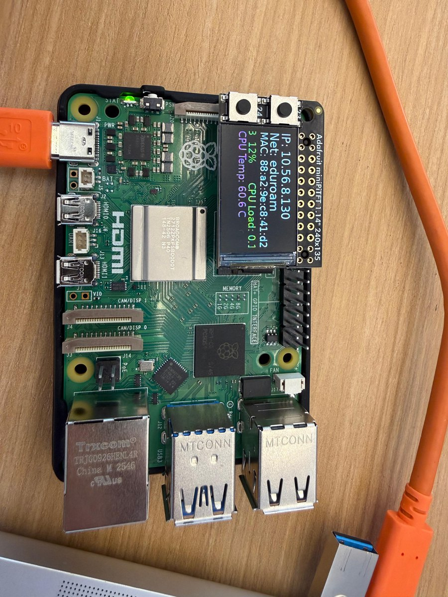
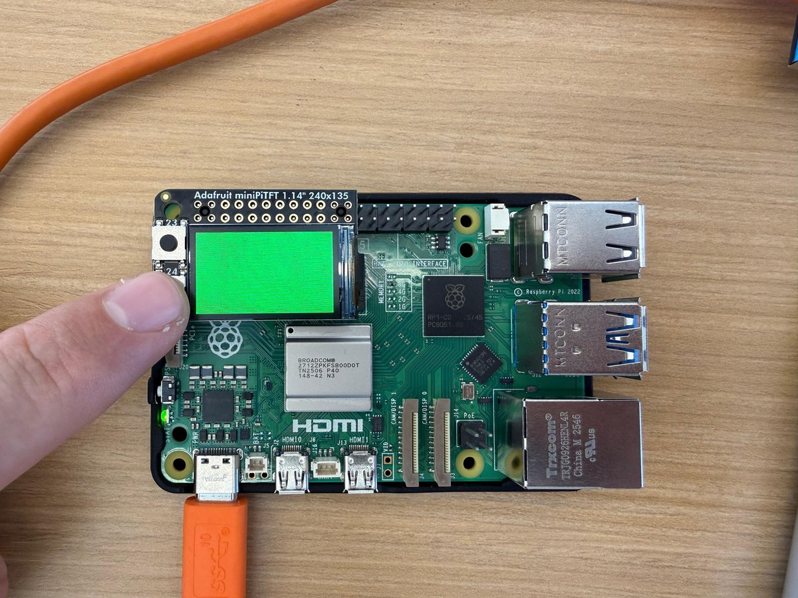
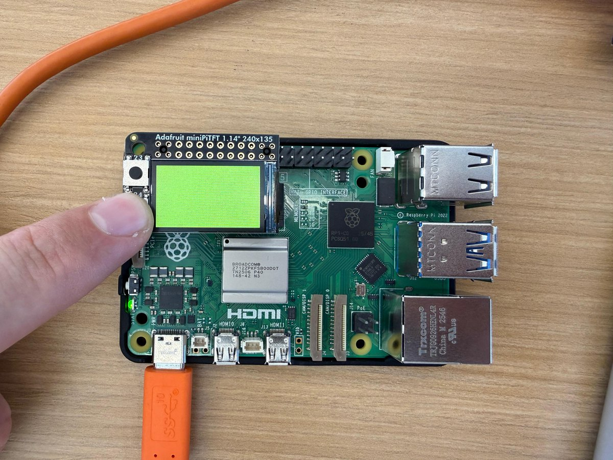
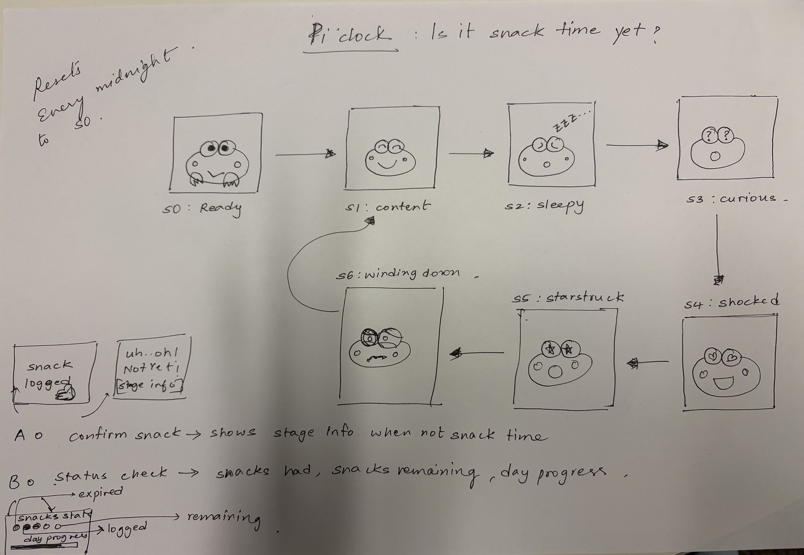
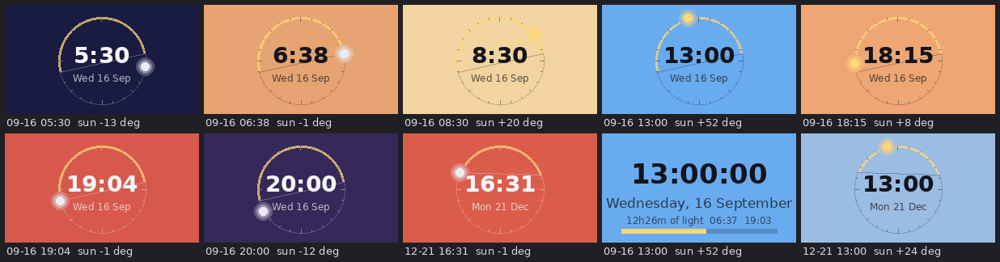
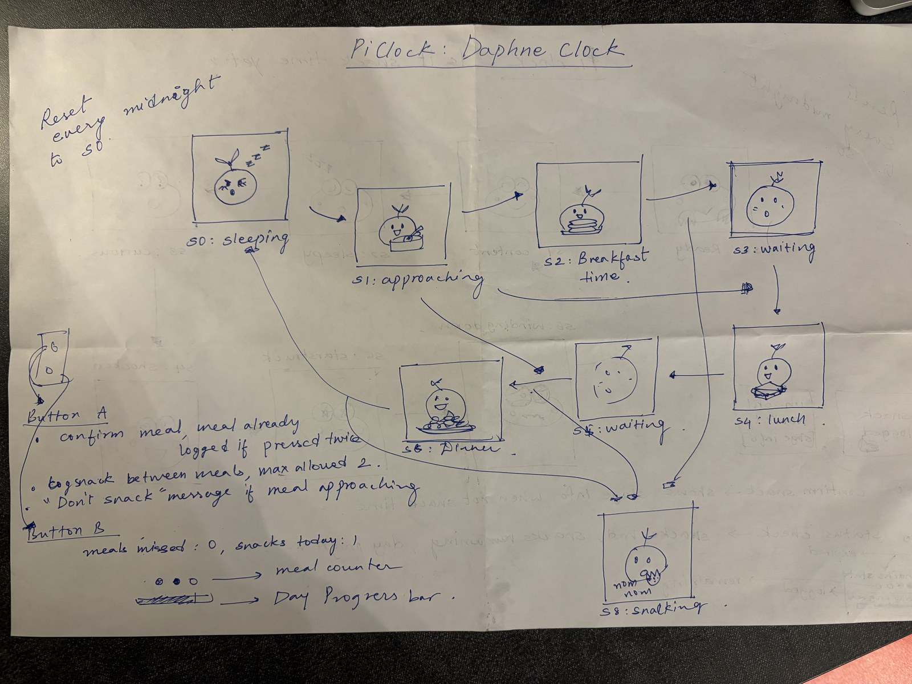

# Interactive Prototyping: The Clock of Pi
**Andreas Kilbinger and [Rohil Saraf](https://github.com/rohilsaraf97).**

Lab 2 Part 2 — the **Daphne Clock** — is joint work with Rohil, and is turned in by both of
us. The group turn-in also lives in
[Rohil's Lab Hub](https://github.com/rohilsaraf97/Interactive-Lab-Hub/tree/Fall2026/Lab%202).
Parts A–D and the daylight clock below are my own.

*(I was originally paired with Dylan Restrepo, who dropped the class before Lab 2.)*

Does it feel like time is moving strangely during this semester?

For our first Pi project, we will pay homage to the [timekeeping devices of old](https://en.wikipedia.org/wiki/History_of_timekeeping_devices) by making simple clocks.

It is worth spending a little time thinking about how you mark time, and what would be useful in a clock of your own design.

**Please indicate anyone you collaborated with on this Lab here.**
Be generous in acknowledging their contributions! And also recognizing any other influences (e.g. from YouTube, Github, Twitter) that informed your design. 

I was originally paired with **Dylan Restrepo** for this lab. He has since dropped the
class, so the work here was done solo from that point on.

**Who did what.** The Daphne Clock in Part 2 is joint work with
[Rohil Saraf](https://github.com/rohilsaraf97): I made the character animations for
Daphne's eleven states, and we designed the meal/snack state machine and the button
behaviour together. Parts A–D of this lab, and the daylight clock in Part E, are mine
alone. The same group turn-in appears in
[Rohil's Lab Hub](https://github.com/rohilsaraf97/Interactive-Lab-Hub/tree/Fall2026/Lab%202).

**AI contributions on the Daphne Clock.** We used ChatGPT to generate the animated GIFs of
the character, and Claude to help design the meal/snack state machine and button logic and
to write and debug the Python driving the animations.

**AI contributions elsewhere in this lab.** I used Claude (Anthropic's Claude Code)
throughout the setup and the daylight clock. Specifically it:

- diagnosed why the Pi had no internet — it was associated with **RedRover**, Cornell's
  visitor network, and stuck behind a captive portal that a headless device cannot sign
  into, so every DNS lookup returned the portal's own address instead of the real host;
- moved the Pi to **eduroam** over `nmcli`, which is what Cornell's own help page
  prescribes for a device whose owner has a NetID;
- found that eduroam then failed for a non-obvious reason: the Pi's clock read
  **2025-08-28**, over a year in the past, so PEAP rejected Cornell's RADIUS certificate
  as "not yet valid". No RTC battery, no network, no NTP — a deadlock broken by setting
  the clock by hand. The same stale clock would also have broken `git clone` over HTTPS;
- ran the Part A and Part B steps over SSH (venv, git identity, clone, `pip install`,
  verifying `cli_clock.py`);
- wrote the Part D fill-in for `screen_clock.py` and the `daylight_clock.py` design
  below, and rendered the clock at eight times of day to check the palette — which caught
  the digits colliding with the ring, and a mid-morning sky that interpolated through
  dead grey.

The daylight clock concept, and the decision about what to build, came out of a
conversation rather than a single prompt.

## Prep

1. ### Set up your Lab 2 Github

At the start of lab Wednesday, ensure you have the latest lab content by updating your forked repository. 

**📖 [Follow the step-by-step guide for safely updating your fork](pull_updates/README.md)**

This guide covers how to pull updates without overwriting your completed work, handle merge conflicts, and recover if something goes wrong.


2. ### Get Kit and Inventory Parts
Take inventory of the kit parts that you have, and note anything that is missing:

***Update your [parts list inventory](partslist.md)***

3. ### Prepare your Pi for lab this week
[Follow these instructions](prep.md) to download and burn the image for your Raspberry Pi before lab Wednesday.


## Overview
For this assignment, you are going to 

A) [Connect to your Pi](#part-a)  

B) [Try out cli_clock.py](#part-b) 

C) [Set up your RGB display](#part-c)

D) [Try out clock_display_demo](#part-d) 

E) [Modify the code to make the display your own](#part-e)

F) [Make a short video of your modified barebones PiClock](#part-f)

G) [Sketch and brainstorm further interactions and features you would like for your clock for Part 2.](#part-g)

## The Report
This readme.md page in your own repository should be edited to include the work you have done. You can delete everything but the headers and the sections between the \*\*\***stars**\*\*\*. Write the answers to the questions under the starred sentences. Include any material that explains what you did in this lab hub folder, and link it in the readme.

Labs are due on Sunday midnight. Make sure this page is linked to on your main class hub page.

## Part A. 
### Connect to your Pi
Just like you did in the lab prep, ssh on to your pi. Once you get there, create a Python environment (named venv) by typing the following commands.

```
ssh pi@<your Pi's IP address>
...
pi@raspberrypi:~ $ python -m venv venv
pi@raspberrypi:~ $ source venv/bin/activate
(venv) pi@raspberrypi:~ $ 

```
### Setup Personal Access Tokens on GitHub
Set your git name and email so that commits appear under your name.
```
git config --global user.name "Your Name"
git config --global user.email "yourNetID@cornell.edu"
```

The support for password authentication of GitHub was removed on August 13, 2021. That is, in order to link and sync your own lab-hub repo with your Pi, you will have to set up a "Personal Access Tokens" to act as the password for your GitHub account on your Pi when using git command, such as `git clone` and `git push`.

Following the steps listed [here](https://docs.github.com/en/authentication/keeping-your-account-and-data-secure/managing-your-personal-access-tokens) from GitHub to set up a token. Depends on your preference, you can set up and select the scopes, or permissions, you would like to grant the token. This token will act as your GitHub password later when you use the terminal on your Pi to sync files with your lab-hub repo.


## Part B. 
### Try out the Command Line Clock
Clone your own lab-hub repo for this assignment to your Pi and change the directory to Lab 2 folder (remember to replace the following command line with your own GitHub ID):

```
(venv) pi@raspberrypi:~$ git clone https://github.com/<YOURGITID>/Interactive-Lab-Hub.git
(venv) pi@raspberrypi:~$ cd Interactive-Lab-Hub/Lab\ 2/
```
Depends on the setting, you might be asked to provide your GitHub user name and password. Remember to use the "Personal Access Tokens" you just set up as the password instead of your account one!

Check if the directory has clone sucessfully, you should see the Interactive-Lab-Hub under the home directory listed:
```
(venv) pi@raspberrypi:~ $ ls
Bookshelf      Documents            Music     Public                 venv
create_img.sh  Downloads            pi-apps   screen_boot_script.py  Videos
Desktop        Interactive-Lab-Hub  Pictures  Templates
(venv) pi@raspberrypi:~ $
```


Install the packages from the requirements.txt and run the example script `cli_clock.py`:

```
(venv) pi@raspberrypi:~/Interactive-Lab-Hub/Lab 2 $ pip install -r requirements.txt
(venv) pi@raspberrypi:~/Interactive-Lab-Hub/Lab 2 $ python cli_clock.py 
02/24/2021 11:20:49
```

The terminal should show the time, you can press `ctrl-c` to exit the script.
If you are unfamiliar with the Python code in `cli_clock.py`, have a look at [this Python refresher](https://hackernoon.com/intermediate-python-refresher-tutorial-project-ideas-and-tips-i28s320p). If you are still concerned, please reach out to the teaching staff!


## Part C. 
### Set up your RGB Display
We have asked you to equip the [Adafruit MiniPiTFT](https://www.adafruit.com/product/4393) on your Pi in the Lab 2 prep already. Here, we will introduce you to the MiniPiTFT and Python scripts on the Pi with more details.


The Raspberry Pi 5 has a variety of interfacing options. When you plug the pi in the red power LED turns on. Any time the SD card is accessed the green LED flashes. It has standard USB ports and HDMI ports. Less familiar it has a set of 20x2 pin headers that allow you to connect a various peripherals.


To learn more about any individual pin and what it is for go to [pinout.xyz](https://pinout.xyz/pinout/3v3_power) and click on the pin. Some terms may be unfamiliar but we will go over the relevant ones as they come up.

### Hardware (you have already done this in the prep)

From your kit take out the display and the [Raspberry Pi 5](https://www.google.com/url?sa=i&url=https%3A%2F%2Fwww.raspberrypi.com%2Fproducts%2Fraspberry-pi-5%2F&psig=AOvVaw330s4wIQWfHou2Vk3-0jUN&ust=1757611779758000&source=images&cd=vfe&opi=89978449&ved=0CBMQjRxqFwoTCPi1-5_czo8DFQAAAAAdAAAAABAE)

Line up the screen and press it on the headers. The hole in the screen should match up with the hole on the raspberry pi.

<p float="left">


</p>

### Testing your Screen

The display uses a communication protocol called [SPI](https://www.circuitbasics.com/basics-of-the-spi-communication-protocol/) to speak with the raspberry pi. We won't go in depth in this course over how SPI works. The port on the bottom of the display connects to the SDA and SCL pins used for the I2C communication protocol which we will cover later. GPIO (General Purpose Input/Output) pins 23 and 24 are connected to the two buttons on the left. GPIO 22 controls the display backlight.

To show you the IP and Mac address of the Pi to allow connecting remotely we created a service that launches a python script that runs on boot. For the following steps stop the service by typing ``` sudo systemctl stop piscreen.service --now```. Othwerise two scripts will try to use the screen at once. You may start it again by typing ``` sudo systemctl start piscreen.service --now```

We can test it by typing 
```
(venv) pi@raspberrypi:~/Interactive-Lab-Hub/Lab 2 $ python screen_test.py
```

You can type the name of a color then press either of the buttons on the MiniPiTFT to see what happens on the display! You can press `ctrl-c` to exit the script. Take a look at the code with
```
(venv) pi@raspberrypi:~/Interactive-Lab-Hub/Lab 2 $ cat screen_test.py
```

#### Displaying Info with Texts
You can look in `screen_boot_script.py` for how to display text on the screen!

#### Displaying an image

You can look in `image.py` for an example of how to display an image on the screen. Can you make it switch to another image when you push one of the buttons?

\*\*\***Include a picture of your own Raspberry Pi displaying the piscreen.service with your unique MAC address. Additionally, please provide another picture showing the successful completion of the screen test.**\*\*\*

### `piscreen.service`, showing my MAC address



The MiniPiTFT shows this Pi's wlan0 MAC, `88:a2:9e:c8:41:d2`, along with the address it
is currently reachable at and the network it is on (`eduroam`, after the move off
RedRover described above).

### `screen_test.py`

The screen sits green when no button is held, and fills with the colour typed at the
prompt while button B is pressed. Holding both buttons turns the backlight off.

| No button — the default green | Button B — the colour I chose |
| --- | --- |
|  |  |


## Part D. 
### Set up the Display Clock Demo
Work on `screen_clock.py`, try to show the time by filling in the while loop (at the bottom of the script where we noted "TODO" for you). You can use the code in `cli_clock.py` and `stats.py` to figure this out.

### How to Edit Scripts on Pi
Option 1. One of the ways for you to edit scripts on Pi through terminal is using [`nano`](https://linuxize.com/post/how-to-use-nano-text-editor/) command. You can go into the `screen_clock.py` by typing the follow command line:
```
(venv) pi@raspberrypi:~/Interactive-Lab-Hub/Lab 2 $ nano screen_clock.py
```
You can make changes to the script this way, remember to save the changes by pressing `ctrl-o` and press enter again. You can press `ctrl-x` to exit the nano mode. There are more options listed down in the terminal you can use in nano.

Option 2. Another way for you to edit scripts is to use VNC on your laptop to remotely connect your Pi. Try to open the files directly like what you will do with your laptop and edit them. Since the default OS we have for you does not come up a python programmer, you will have to install one yourself otherwise you will have to edit the codes with text editor. [Thonny IDE](https://thonny.org/) is a good option for you to install, try run the following command lines in your Pi's ternimal:

  ```
  pi@raspberrypi:~ $ sudo apt install thonny
  pi@raspberrypi:~ $ sudo apt update && sudo apt upgrade -y
  ```

Now you should be able to edit python scripts with Thonny on your Pi.

Option 3. A nowadays often preferred method is to use Microsoft [VS code to remote connect to the Pi](https://www.raspberrypi.com/news/coding-on-raspberry-pi-remotely-with-visual-studio-code/). This gives you access to a fullly equipped and responsive code editor with terminal and file browser.  

Pro Tip: Using tools like [code-server](https://coder.com/docs/code-server/latest) you can even setup a VS Code coding environment hosted on your raspberry pi and code through a web browser on your tablet or smartphone! 

## Part E. Read Part 2. Sketch and brainstorm further interactions and features you would like for your clock.

One potential source of ideas might be thinking about other clocks and timekeeping devices for inspiration.

Another might be novel units of time. How do you measure a year? [In daylights? In midnights? In cups of coffee?](https://www.youtube.com/watch?v=wsj15wPpjLY)

We strongly discourage literal digital or analog clock display: Be creative.


** Insert ideas, sketches, [Verplank diagrams](https://ccrma.stanford.edu/courses/250a-fall-2004/IDSketchbok.pdf)), storyboards for your ideas **

We took two ideas this far. The **Snack Clock** is the one Rohil and I built together for
Part 2; the **daylight clock** is a separate one I built on my own.

### Idea 1 (chosen): the Snack Clock — *is it snack time yet?*

A clock that does not tell you the time at all. It tells you **when you can snack again**.
Snack windows sit six hours apart, measured from your last *confirmed* snack rather than
from a fixed schedule, so the clock's day is shaped by your behaviour rather than by the
hour hand.

The display is a character who reacts, so you read the state off a face instead of a
number:



| Stage | Meaning | Face |
| --- | --- | --- |
| S0 Ready | Before the first snack of the day | Open eyes, smile |
| S1 Content | Just snacked | Closed eyes (^\_^), blush |
| S2 Sleepy | Early in the wait | Half-lidded, flat mouth |
| S3 Curious | Window coming up | Round alert eyes, small "o" |
| S4 Shocked | Just before the window opens | Wide eyes, wavy mouth, sweat drop |
| S5 Starstruck | **Window open — snack now** | Star pupils, big smile, sparkles |
| S6 Winding down | Window closing | Half-lidded, fading blush |

**Button A confirms a snack**, and what it does depends on where you are in the cycle: in
S0 it logs the first snack of the day, in S5 it logs one and resets the timer, and in any
other stage it refuses and tells you why — *"not yet, still waiting"*, *"almost time"*,
*"window's closing"*. **Button B** is a status check: filled dots for snacks had, empty dots
for windows still available, and a day-progress bar. Everything resets at midnight.

The refusal is the part we cared about. A clock that only says *yes* is a timer; one that
says *not yet, and here's how not-yet you are* is a character with an opinion.

### Idea 2: a daylight clock

Instead of hands or a readout, the whole screen is **the sky at this moment**. The 24
hours are a single ring — noon at the top, midnight at the bottom. A sun rides that ring
and becomes a moon once it sets, and the background is the colour of the sky right now.
The intent is that you read the rough time from *where the light is* before you ever read
a digit, the way you do glancing out of a window.

The colour is driven by the **sun's actual elevation**, computed for the date and for
this latitude with NOAA's solar position algorithm, rather than by the clock hour. That
distinction matters over a semester: sunset here is 19:03 in mid-September and 16:32 just
before finals, so a palette keyed to fixed hours would still be showing afternoon blue an
hour after dark in December. For the same reason the lit part of the ring is the part of
*today* that the sun is really up — thirteen hours now, nine by the solstice — and the
horizon line is drawn between the true sunrise and sunset points, so it tilts through the
year instead of sitting flat across 06:00/18:00.

The same elevation is also given two different colours depending on whether the sun is
climbing or falling, because a morning and an evening at the same height do not look
alike: mornings run through a warm yellow, evenings through red and orange.

Checked against almanac times for New York, the solar maths lands within a minute across
the year (sunrise 06:38 vs 06:39 on 16 Sep, 05:25 vs 05:25 at the June solstice, 07:17 vs
07:16 at the December one).

A first working version is in [`daylight_clock.py`](daylight_clock.py). Rendered across a
September day, with two December frames for comparison — note how much shorter the lit
arc is at the solstice:



Button A cycles between three faces and button B toggles 12/24 hour:

1. **Sky** — the ring, the horizon, the lit arc of today, and the sun or moon riding it.
2. **Digits** — a plain readout, today's sunrise and sunset, how many hours of light the
   day holds, and a bar for how much of it has gone.
3. **Units** — the day measured in things that are not hours: percent spent, how many
   degrees the sun is above the horizon, coffees deep. This is the [in daylights, in
   midnights, in cups of coffee](https://www.youtube.com/watch?v=wsj15wPpjLY) idea the
   lab points at.

Several things only became apparent once it was rendered rather than imagined, which is
why the eight-frame sheet above exists at all — it is much faster to check a whole day
that way than to wait for one.

- At 34pt the digits collided with the ring, so the ring face uses a smaller size than
  the digits face does.
- The sky palette originally interpolated from an orange 08:00 straight to a blue 10:00.
  That passes through grey, making mid-morning the one hour of the day that looked like a
  dead LCD. Each ramp now stays on one side of neutral, crossing over at a single bright
  haze rather than sliding through mud.
- The lit arc was initially drawn on the wrong half of the ring: PIL sweeps an arc
  clockwise from start to end, so running it sunrise → sunset highlights the *night*.
- Keying the warm morning band to the sun's true elevation put the switch to blue at
  about 08:15, which is astronomically fair but reads wrong — half past eight still feels
  like morning. The warm band now holds until the sun is about 28° up.

**Put the names of the people you gave feedback to here. (Even better, add links to their repos here!)**

- [Max Corkran](https://github.com/LaboriouslyExquisite/Interactive-Lab-Hub/blob/Fall2026/Lab%202/README.md)
- [cgyh98](https://github.com/cgyh98/Interactive-Lab-Hub/tree/Fall2026/Lab%202)

# Lab 2 Part 2

## Prep 

1. Pick up remaining parts for kit on Wednesday lab class. Check the updated [parts list inventory](partslist.md) and let the TA know if there is any part missing.

2. Look at and give feedback on the Part E. for at least 3 other people in the class and get 3 people to comment on your Part E!)
**Put the feedback for your ideas here.**

Three people commented on the Snack Clock:

> I love it! Also maybe hydration?? That would be my first thought

> Snacks are the best! Your snack clock is very fun and very thought out and I can see the
> tie in between an animated character's body language to denote how much time has passed
> since the user last ate a snack. I think some fun metrics to add to the clock would be how
> many snacks you did eat throughout the day and perhaps changing how the character
> [looks] (physically, fatter, skinnier, based on the amount of snacks it had during the
> week). Overall very good design, and you can go very far with it. The only feedback I have
> is perhaps adding interaction based on the amount of snacks eaten would also be
> interesting to implement.

> I think that the concept is cute but there are some states which may confuse the user. I
> associate a snack time with hunger so I think there could be imagery that explains that
> relationship better. Maybe a thought bubble with food? Also I don't know how the buttons
> will work during the midnight snack time since the user would be asleep.

**What we did with it.** Two of the three pushed in the same direction — the states read as
moods, but nothing in them says *food*. That fed directly into the redesign below: the
character now has explicit meal states (breakfast, lunch, dinner, snacking) rather than
abstract emotional ones, so the subject of the clock is legible from the screen alone. The
third comment about the midnight snack exposed a real hole in the original design, since a
six-hour rolling window will happily open at 04:00 and demand a response from someone
asleep. The fixed meal schedule with an explicit overnight sleep state fixes that.

We did not take up the "make the character fatter" suggestion. Tracking snacks is one
thing; a device that visibly judges your body for eating is another.

## Update your Lab Hub

[Update your Lab Hub](pull_updates/README.md) to get the latest content and requirements for Part 2.

## Modify the barebones clock to make it your own

Start small, pick just one element of your overall idea, just to show you have a handle on the code and components.

\*\*\***Put a copy of your code in your Lab 2 Github repo.**\*\*\*

The first pass was one element only: get a single character animation onto the screen and
cycling, to prove we could drive the display and the buttons. Code in
[`daphne_clock/init_clock.py`](daphne_clock/init_clock.py).

## Make a short video of your modified barebones PiClock

\*\*\***Take a video of your barely modified PiClock.**\*\*\*

▶ **https://youtube.com/shorts/vckRZVUIjEU**

After you edit and work on the scripts for Lab 2, the files should be upload back to your own GitHub repo! You can push to your personal github repo by adding the files here, commiting and pushing.

```
(venv) pi@raspberrypi:~/Interactive-Lab-Hub/Lab 2 $ git add .
(venv) pi@raspberrypi:~/Interactive-Lab-Hub/Lab 2 $ git commit -m 'your commit message here'
(venv) pi@raspberrypi:~/Interactive-Lab-Hub/Lab 2 $ git push
```

After that, Git will ask you to login to your GitHub account to push the updates online, you will be asked to provide your GitHub user name and password. Remember to use the "Personal Access Tokens" you set up in Part A as the password instead of your account one! Go on your GitHub repo with your laptop, you should be able to see the updated files from your Pi!

## Now, make your own PiClock

Do take advantage of having done the previous iteration to refine and simplify your design.

** Insert any updates ideas, sketches, [Verplank diagrams](https://ccrma.stanford.edu/courses/250a-fall-2004/IDSketchbok.pdf))!, storyboards for your ideas **

### The Daphne Clock

The refinement the feedback asked for. The rolling six-hour window is gone, replaced by a
**fixed meal schedule** — breakfast, lunch, dinner — with up to two snacks allowed in each
gap between them. The character, Daphne, is calm after eating, alert as a meal approaches,
excited when a window opens, and asleep overnight after dinner.



| Stage | When |
| --- | --- |
| Meal approaching | Less than 20 minutes before a meal window opens |
| Meal open | Inside a meal's eating window |
| Gap | Between meals — snack-eligible, maximum two |
| Overnight gap | After dinner closes until breakfast approaches — sleep state |

**Button A** logs a meal if one is open, logs a snack if you are in a gap and have snacks
left, or explains why it will not — *"not open yet"*, *"no more snacks till next meal"*.
**Button B** held down shows meals had and missed, snacks had today, and how far through the
day you are.

Simplifying to a fixed schedule is what made the overnight problem disappear: there is no
longer any way for the clock to open a window at four in the morning, because the windows
are set by the day rather than by the last thing you ate.

\*\*\***Put a copy of your code in your Lab 2 Github repo.**\*\*\*

| File | What it does |
| --- | --- |
| [`daphne_clock/run_clock.py`](daphne_clock/run_clock.py) | Main loop — display, buttons, state |
| [`daphne_clock/meal_clock.py`](daphne_clock/meal_clock.py) | The meal/snack state machine |
| [`daphne_clock/init_clock.py`](daphne_clock/init_clock.py) | The first-pass barebones version |
| [`assets/`](assets/) | Daphne's eleven animated states |

\*\*\***Take a video of your PiClock.**\*\*\*

▶ **https://youtube.com/shorts/7cZNvw4GQWU**


As always, make sure you document contributions and ideas from others (and AI) explicitly in your writeup.

You are permitted (but not required) to work in groups and share a turn in; you are expected to make equal contribution on any group work you do, and N people's group project should look like N times the work of a single person's lab.  Make sure the page for the group turn in is linked to your personal Interactive Lab Hub page. 


